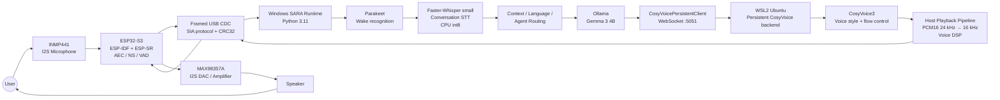
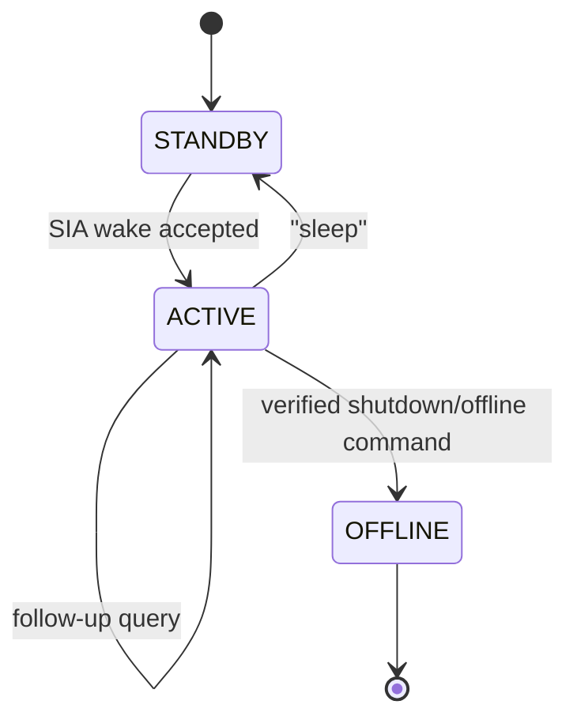

# SARA / SIA — Cross-Device Local AI Voice Assistant

> **An embedded + local-AI voice assistant that spans ESP32-S3 firmware, a Windows orchestration runtime, local speech recognition, Ollama LLM inference, and a persistent WSL2 CosyVoice speech backend.**

SARA is not implemented as a single “speech → chatbot → speech” script. It is a **heterogeneous real-time system** with explicit hardware transport, assistant state, multilingual speech routing, local inference, tool/agent routing, and a separate GPU speech-serving environment.

**Repository:** `Swastiksinghcare66/ai-local-assistant`
**Primary runtime entry:** `main_web_consent.py`
**Validated host Python:** 3.11.6
**Validated local LLM configuration:** `gemma3:4b` through Ollama

---

## Why this project is interesting

SARA combines several engineering domains in one working system:

- **Embedded systems:** ESP32-S3, I2S microphone/speaker, ESP-IDF, ESP-SR, USB CDC
- **Speech AI:** Parakeet wake recognition, Faster-Whisper multilingual STT
- **LLM systems:** local Ollama inference, streaming generation, context/history
- **Speech synthesis:** persistent CosyVoice client/server, voice styles, flow-step control
- **GPU systems:** WSL2, vLLM/TensorRT-oriented TTS stack
- **Systems programming:** framed binary protocol, CRC32, queues, threads, state machines
- **Audio systems:** PCM16 mono, full-duplex firmware design, 24 kHz → 16 kHz streaming resampling
- **Agentic capabilities:** local-information routing, PC actions, media/tool routing
- **Product behavior:** standby/active/offline modes, startup experience, sleep command, failure handling

---

## Architecture at a glance



The firmware is designed around **16 kHz PCM16 mono** for the embedded full-duplex/AEC path. CosyVoice audio is received by the host at 24 kHz and converted to 16 kHz before transport to the ESP32.

---

## Runtime behavior



The runtime maintains richer internal voice states as well:

`STANDBY → WAKE_ACK → LISTENING → TRANSCRIBING → THINKING → SPEAKING → ACTIVE_WAIT`

A key product decision is that **silence does not return SARA to wake-word mode**. Once awake, the assistant remains active until the user explicitly says `sleep`.

---

## End-to-end request flow

```text
User speech
   ↓
INMP441
   ↓ I2S
ESP32-S3 audio front-end
   ↓ framed USB CDC
Windows SARA runtime
   ↓
Parakeet wake recognition
   ↓
Faster-Whisper conversation transcription
   ↓
Conversation + language + agent routing
   ↓
Ollama / Gemma 3 4B streaming response
   ↓
Sentence / phrase buffering
   ↓
English: CosyVoice persistent WebSocket
Hindi/Hinglish: Piper path when selected/available
   ↓
PCM playback pipeline
   ↓ 24 kHz → 16 kHz for CosyVoice path
USB CDC TTS frames
   ↓
ESP32-S3
   ↓ I2S
MAX98357A
   ↓
Speaker
```

---

## Effective AI stack

| Function | Effective implementation |
|---|---|
| Wake / fast English STT | `sherpa-onnx-nemo-parakeet-tdt-0.6b-v2-int8` |
| Conversation STT | Faster-Whisper `small`, CPU `int8` |
| Multilingual fallback | Parakeet if Faster-Whisper is unavailable |
| LLM runtime | Ollama |
| LLM model | `gemma3:4b` |
| Context window | 4096 |
| Max generated tokens | 160 |
| LLM streaming | Enabled |
| LLM keep-alive | 30 minutes |
| LLM GPU offload | 4 layers in current client configuration |
| English/high-quality TTS | Persistent CosyVoice WebSocket |
| CosyVoice endpoint | `ws://127.0.0.1:5051/tts` |
| Hindi/Hinglish TTS | Piper `hi_IN-priyamvada-medium` when enabled |
| Piper compute | CPU |
| Embedded playback rate | 16 kHz PCM16 mono |
| CosyVoice client input rate | 24 kHz PCM16 mono |

> Some historical comments still mention Qwen or older TTS names. The table above follows the **current executable configuration and instantiated classes** in `app/config.py`, `app/llm_client.py`, and `app/pipeline/voice_pipeline.py`.

---

## Embedded audio architecture

The ESP32 firmware is native **ESP-IDF + ESP-SR**, not the original Arduino mic-only prototype.

Implemented/architected firmware features include:

- INMP441 I2S capture
- MAX98357A I2S playback
- AEC using the exact speaker playback reference
- single-channel noise suppression
- VAD
- processed microphone streaming
- continuous TTS PCM playback
- framed USB CDC transport
- sequence numbers + CRC32
- health counters
- safe boot routing
- PSRAM validation
- OTA-capable partition layout

With one microphone, the system can perform **AEC, single-channel NS and VAD**, but it does **not** claim true spatial beamforming or consumer-headphone-style ANC.

---

## Host ↔ ESP32 protocol

`SIAHardware` owns one persistent serial connection for the runtime.

Current transport defaults:

- **Baud:** 921600
- **Validated ESP USB VID:PID:** `303A:4001`
- **Protocol magic:** `0x31414953`
- **Protocol version:** `1`

Representative message types:

```text
HOST_HELLO / DEVICE_HELLO
SET_ROUTE / ROUTE_ACK
PING / PONG
GET_STATS / STATS

MIC_START / MIC_PCM / MIC_STOP
VAD_EVENT

TTS_START / TTS_READY
TTS_PCM
TTS_END / TTS_DONE
```

The protocol includes CRC32 validation and explicit device/session events rather than treating audio as an unstructured serial byte stream.

---

## Language-aware speech path

SARA separates wake recognition from conversation recognition.

### Wake
Parakeet remains the proven wake/English recognizer.

### Conversation
Faster-Whisper handles Hindi, Hinglish and English after wake.

### Output routing
The language router can select:

- English
- Hindi
- Hinglish

Explicit user language requests override automatic detection.

For output:

- English/high-quality path uses CosyVoice
- Hindi/Hinglish can use the Piper `hi_IN-priyamvada-medium` path
- Piper falls back safely if unavailable

---

## Agent and local capability layer

Before normal LLM conversation, SARA can route supported requests into local capabilities.

Examples present in the repository include:

- installed-application resolution
- PC actions
- local system information
- process/network/system-status queries
- YouTube/media normalization
- offline-knowledge routing
- web-search tool integration
- policy checks for sensitive actions

The main runtime also has a private shutdown-verification path that avoids putting the verification transcript into conversation history or sending it to the LLM.

---

## Streaming and latency instrumentation

The pipeline tracks:

- endpoint latency
- STT latency
- LLM time-to-first-token
- phrase/chunk wait
- TTS time-to-first-audio
- speech-end → first-audio latency

`VoiceTiming` records these boundaries explicitly so performance can be measured instead of estimated.

The repository also contains:

- `benchmark_sara_pipeline.py`
- `benchmark/`

See [Benchmarks](docs/BENCHMARKS.md) for what is already validated and what should still be measured before publishing numbers.

---

## Repository map

```text
ai-local-assistant/
├── main_web_consent.py          # Main validated runtime entry
├── app/
│   ├── agent/                   # Capability, intent and PC-agent layer
│   ├── audio/                   # STT, TTS, language routing, hardware audio
│   ├── hardware/                # Protocol/resampling hardware abstractions
│   ├── pipeline/                # Voice pipeline and streaming text handling
│   ├── ui/
│   ├── config.py
│   └── llm_client.py
├── firmware/
│   └── esp32_s3/                # Native ESP-IDF / ESP-SR firmware
├── frontend/                    # React/Vite UI work
├── services/
├── scripts/
├── tests/
├── benchmark/
├── benchmark_sara_pipeline.py
├── wsl_cosyvoice/
│   ├── COSYVOICE_COMMIT.txt
│   ├── MATCHA_COMMIT.txt
│   ├── requirements_wsl_lock.txt
│   ├── sara_voice_styles.py
│   └── services/
├── docs/
└── README.md
```

---

## Documentation

| Document | Purpose |
|---|---|
| [Architecture](docs/ARCHITECTURE.md) | Component boundaries and system decomposition |
| [Complete System Flow](docs/SYSTEM_FLOW.md) | Boot, wake, query, TTS, sleep and failure paths |
| [Design Decisions](docs/DESIGN_DECISIONS.md) | Why the architecture is built this way |
| [Hardware](docs/HARDWARE.md) | ESP32-S3, audio front-end, protocol and firmware |
| [WSL2 / CosyVoice](docs/WSL_COSYVOICE.md) | Persistent TTS backend and reproducibility |
| [Benchmarks](docs/BENCHMARKS.md) | Measured metrics and benchmark methodology |
| [Demo Guide](docs/DEMO_GUIDE.md) | 60–90 second interview/demo flow |

---

## How to explain SARA in 30 seconds

> **SARA is a cross-device local conversational AI runtime. I split the system into an ESP32-S3 embedded audio front-end, a Windows orchestration layer, and a WSL2 GPU speech backend. The ESP32 runs the I2S audio path and ESP-SR front-end, Windows handles wake state, multilingual STT, context, agent routing and a local Gemma 3 4B model through Ollama, and WSL2 hosts persistent CosyVoice speech synthesis. The synthesized PCM is resampled and streamed back to the ESP32, which drives the speaker through a MAX98357A.**

---

## What I would discuss in a technical interview

Good deep-dive topics in this repository:

1. Why split wake STT and conversation STT?
2. Why use a persistent TTS server?
3. Why isolate the TTS environment in WSL2?
4. Why is the embedded audio contract 16 kHz?
5. How does the framed USB protocol work?
6. Why use explicit assistant states instead of a simple loop?
7. How do you prevent stale audio/session state?
8. How do CPU/GPU resource constraints affect LLM and TTS placement?
9. How is language routing separated from model inference?
10. What breaks first when latency increases?
11. What should run on the edge vs host?
12. How would you package this without WSL?

---

## Current limitations / technical debt

This repository intentionally documents the current system rather than presenting unfinished work as complete.

- Stable host-side barge-in is currently **disabled**.
- Firmware is designed for AEC/full-duplex operation, but host interruption behavior still needs tuning/validation.
- The production one-click installer is not finished.
- Large model files, caches, venvs and generated TensorRT engines are not committed.
- Some historical source comments still refer to earlier Qwen/TTS configurations.
- The current client/server flow-step configuration should be normalized before publishing it as a fixed benchmark.
- The custom WSL CosyVoice server source must be present in `wsl_cosyvoice/services/` before treating the public repository as fully reproducible.

---

## Reproducibility policy

The repository keeps:

- project-authored source
- exact upstream commit pins
- dependency locks
- firmware source
- tests
- architecture documentation

It intentionally excludes:

- `.venv` / WSL virtual environments
- Ollama model blobs
- ONNX/GGUF/Safetensors weights
- generated TensorRT plans
- Hugging Face caches
- ESP-IDF build products / managed dependencies
- large Wikipedia/RAG datasets

---

## Author

**Swastik Singh**
B.Tech, Electronics and Communication Engineering — VIT Vellore

Areas of interest: **AI systems, embedded AI, local LLMs, edge intelligence, robotics, and AI/software architecture.**
