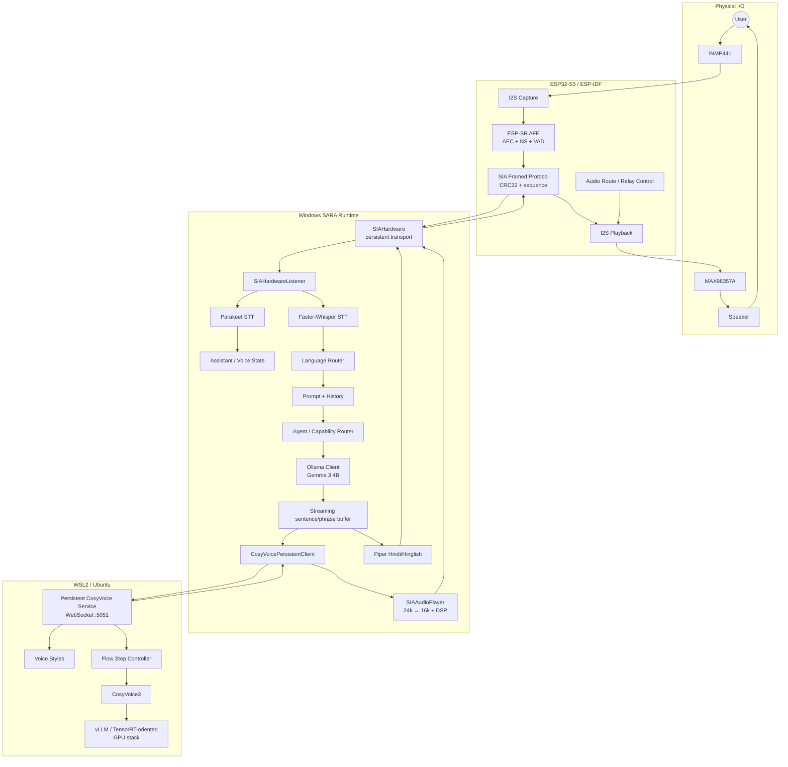

# SARA / SIA — System Architecture

## 1. Architectural objective

SARA is designed as a **heterogeneous local-AI system**, not a monolithic Python application.

Three execution environments have distinct responsibilities:

| Environment | Responsibility |
|---|---|
| ESP32-S3 | real-time physical audio I/O, AFE, VAD, routing, framed USB transport |
| Windows | assistant state, STT, conversation, agent/tools, LLM orchestration, audio resampling |
| WSL2 | persistent high-quality CosyVoice inference stack |

This separation is the main architectural idea of the project.

---

## 2. Component architecture



---

## 3. Main software entry

The validated entry point is:

```text
main_web_consent.py
```

It owns the top-level application state:

```text
STANDBY
ACTIVE
OFFLINE
```

The voice pipeline additionally exposes:

```text
STANDBY
WAKE_ACK
LISTENING
TRANSCRIBING
THINKING
SPEAKING
INTERRUPTED
ACTIVE_WAIT
OFFLINE
```

The separation is useful: **application mode** is not the same thing as **moment-to-moment voice activity**.

---

## 4. Embedded layer

Canonical firmware:

```text
firmware/esp32_s3/
```

The current firmware is native ESP-IDF / ESP-SR and is designed for:

- INMP441 microphone capture
- MAX98357A playback
- 16 kHz PCM16 mono embedded audio contract
- full-duplex AEC architecture
- single-channel noise suppression
- VAD
- framed USB CDC transport
- route switching
- health / diagnostics
- OTA-capable partition layout

The firmware README correctly limits its claims: one microphone does not provide true spatial beamforming or headphone-style ANC.

---

## 5. Windows hardware abstraction

Primary implementation:

```text
app/audio/sia_hardware.py
```

`SIAHardware` owns one persistent serial connection.

Why this matters:

- STT does not parse raw serial frames.
- TTS does not manually manage COM-port state.
- protocol CRC, session events and routing are centralized.
- the transport is independently testable.

The transport uses structured message types for mic streaming, VAD, TTS, route control and health operations.

---

## 6. Speech input architecture

### Standby / wake

Wake recognition uses Parakeet:

```text
sherpa-onnx-nemo-parakeet-tdt-0.6b-v2-int8
```

Parakeet remains the known wake recognizer.

### Active conversation

After wake, the pipeline prefers Faster-Whisper:

```text
model: small
device: CPU
compute: int8
beam size: 1
```

If the multilingual recognizer is unavailable and fallback is enabled, the pipeline returns to Parakeet.

### Why the split?

Wake recognition prioritizes a proven low-latency path. Conversation recognition prioritizes multilingual coverage.

---

## 7. Language routing

`LanguageRouter` supports:

```text
english
hindi
hinglish
```

Priority:

1. explicit user language request
2. configured policy
3. script / lexical detection
4. conversation language continuity
5. default language

Explicit requests such as “in English” or “Hindi mein” override automatic policy.

---

## 8. LLM architecture

Source:

```text
app/config.py
app/llm_client.py
```

Current effective configuration:

```text
provider       = ollama
model          = gemma3:4b
host           = http://127.0.0.1:11434
context        = 4096
max tokens     = 160
temperature    = 0.7
keep-alive     = 30m
streaming      = true
think          = false
num_gpu        = 4
```

The `num_gpu=4` choice reflects resource sharing: the LLM should not monopolize the GPU while the speech backend is resident.

Historical comments in the file still say “Qwen”; those comments are not the effective model selection.

---

## 9. Agent / capability architecture

The top-level command path can route supported requests before generic conversation.

Relevant components include:

```text
app/agent/main_bridge.py
app/agent/runtime.py
app/agent/intent.py
app/agent/knowledge_router.py
app/agent/local_information.py
app/agent/pc_broker.py
app/agent/app_resolver.py
app/agent/tools/
```

Request categories include:

- action
- casual conversation
- local information
- knowledge information

The agent layer can handle supported local requests and returns structured state/intent information to the voice runtime.

Unsupported actions should not be falsely reported as successful.

---

## 10. TTS architecture

### English / high-quality path

Windows uses:

```text
CosyVoicePersistentClient
ws://127.0.0.1:5051/tts
```

One persistent WebSocket can carry sequential TTS requests. This removes connection/model-startup overhead from every phrase.

### Hindi / Hinglish path

Piper is configured with:

```text
hi_IN-priyamvada-medium
CPU execution
16 kHz hardware target
```

The pipeline can fall back when Piper is unavailable rather than failing the whole assistant.

---

## 11. Playback architecture

CosyVoice client audio is PCM16 mono at 24 kHz.

`SIAAudioPlayer` performs:

```text
24 kHz PCM
   ↓ stateful rate conversion
16 kHz PCM
   ↓ VoiceOutputDSP
framed TTS transport
   ↓
ESP32-S3
```

The player maintains resampler state across chunks, which is critical for streaming continuity.

---

## 12. Concurrency model

The architecture uses:

- `asyncio` for orchestration
- background threads for serial/audio workers
- queues for PCM transport
- locks/events for protocol/session coordination
- persistent network/serial connections

This is why systems-Python concepts such as `Thread`, `Queue`, `Lock`, `Event`, `Future` and coroutines matter directly in SARA.

---

## 13. Security / control boundaries

The main runtime treats state/security commands before generic conversation.

A shutdown verification path is intentionally private:

- recognition result is not printed
- not stored in chat history
- not sent to the LLM
- comparison uses constant-time `hmac.compare_digest`

This is a good example of keeping security-critical logic outside the language model.

---

## 14. Stable-path constraint

The current stable host pipeline explicitly sets:

```text
barge_in_enabled = False
```

The firmware architecture supports AEC/full-duplex work, but interruption behavior should not be advertised as a fully validated production feature until host integration/tuning is completed.

---

## 15. Architecture takeaway

SARA’s core design principle is:

> **Keep physical I/O, host orchestration, model serving, and product policy separate enough that each can be replaced or optimized without rewriting the entire assistant.**
