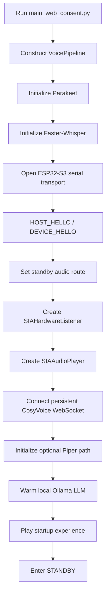
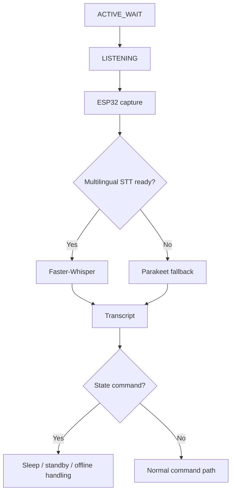
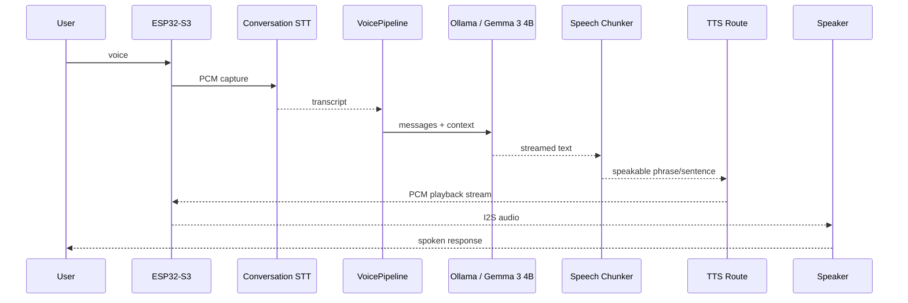

# SARA / SIA — Complete System Flow

## 1. Boot flow



Important implementation detail: the pipeline intentionally connects the TTS backend before warming the LLM so the speech stack is already resident when the assistant becomes ready.

---

## 2. Standby / wake flow

```text
STANDBY
   ↓
speaker route set to standby/Bluetooth path
   ↓
ESP32 microphone stream
   ↓
SIAHardwareListener
   ↓
Parakeet wake recognition
   ↓
wake accepted
   ↓
speaker route switched to SIA/MAX98357A
   ↓
ACTIVE
```

If the wake utterance contains only the wake word, the runtime can produce an acknowledgement and remain active.

If it contains both wake + query, the recognized command can immediately enter command processing.

---

## 3. Active-session rule

Once SARA enters ACTIVE mode:

- the wake word is not required again
- short internal listening timeouts do **not** return to STANDBY
- the runtime simply starts another active listening cycle
- only an explicit sleep/standby command returns to wake mode

This prevents the “say wake word before every sentence” UX problem.

---

## 4. Active capture flow



---

## 5. Transcript routing flow

The current runtime has several layers before generic LLM conversation.

```text
transcript
   ↓
state / security commands
   ↓
pending consent / clarification handling
   ↓
agent / capability router
   ├─ local information
   ├─ PC action
   ├─ media/tool route
   ├─ supported knowledge route
   └─ unsupported / clarification result
   ↓
normal conversation fallback
   ↓
PromptBuilder + history
   ↓
Ollama streaming generation
```

The important design principle is that deterministic local/state operations should not be delegated blindly to the LLM.

---

## 6. Normal conversation generation



---

## 7. Streaming text behavior

`SemanticPhraseBuffer` is conservative about sentence boundaries.

It avoids splitting technical text at periods in cases such as:

```text
3.14
qwen3:1.7b
app.py
example.com
U.S.
inline code
```

This matters because premature splitting creates unnatural TTS chunks and can corrupt technical answers.

---

## 8. English TTS flow

```text
LLM streamed text
   ↓
sentence / phrase boundary
   ↓
CosyVoicePersistentClient
   ↓ persistent WebSocket :5051
WSL2 CosyVoice backend
   ↓
PCM16 mono @ 24 kHz
   ↓
SIAAudioPlayer
   ↓ stateful 24k → 16k conversion
VoiceOutputDSP
   ↓
TTS_START
TTS_PCM...
TTS_END
   ↓
ESP32-S3
   ↓
MAX98357A
   ↓
Speaker
```

---

## 9. Hindi / Hinglish output flow

When the language router selects a supported Hindi/Hinglish path and Piper is available:

```text
response text
   ↓
Hinglish/Hindi processing
   ↓
Piper hi_IN-priyamvada-medium
   ↓
single resample to firmware target
   ↓
16 kHz PCM16
   ↓
ESP32-S3 playback
```

Piper is intentionally kept on CPU so it does not compete with the local LLM / CosyVoice GPU workload.

---

## 10. Sleep flow

```text
ACTIVE
   ↓
transcript == sleep / equivalent
   ↓
clear pending consent
clear pending clarification
   ↓
speak standby response
   ↓
STANDBY
```

---

## 11. Offline / shutdown flow

Offline commands are handled before normal conversation.

If verification is enabled:

```text
offline command
   ↓
private spoken verification
   ↓
private transcript
   ↓
constant-time comparison
   ├─ correct → OFFLINE
   ├─ cancel  → ACTIVE
   └─ retries exhausted → ACTIVE
```

The private transcript is intentionally kept outside normal history and LLM calls.

---

## 12. Failure flow

### Faster-Whisper unavailable
Parakeet fallback can keep conversation functional.

### Piper unavailable
English/CosyVoice remains operational; Piper failure does not prevent boot.

### ESP32 unavailable
Initialization fails because the physical audio boundary is required by the validated hardware runtime.

### CosyVoice unavailable
Persistent TTS initialization/connectivity fails; the validated voice runtime should not pretend TTS is ready.

### Ollama failure
The LLM client returns a controlled fallback rather than crashing every caller.

---

## 13. Timing instrumentation

Per-turn timing boundaries include:

```text
speech_end
capture_end
stt_start
stt_end
llm_start
llm_first_text
llm_end
first_tts_text
first_audio
playback_end
```

Derived metrics:

```text
endpoint_ms
stt_ms
llm_ttft_ms
chunk_wait_ms
tts_ttfa_ms
speech_to_audio_ms
```

This gives the project a real performance-debugging surface.

---

## 14. Current stable interaction model

```text
BOOT
 ↓
STANDBY
 ↓ "SIA"
ACTIVE
 ↓ query
TRANSCRIBE
 ↓
ROUTE / THINK
 ↓
SPEAK
 ↓
ACTIVE_WAIT
 ↓ query
...
 ↓ "sleep"
STANDBY
```

That loop is the core user experience.
